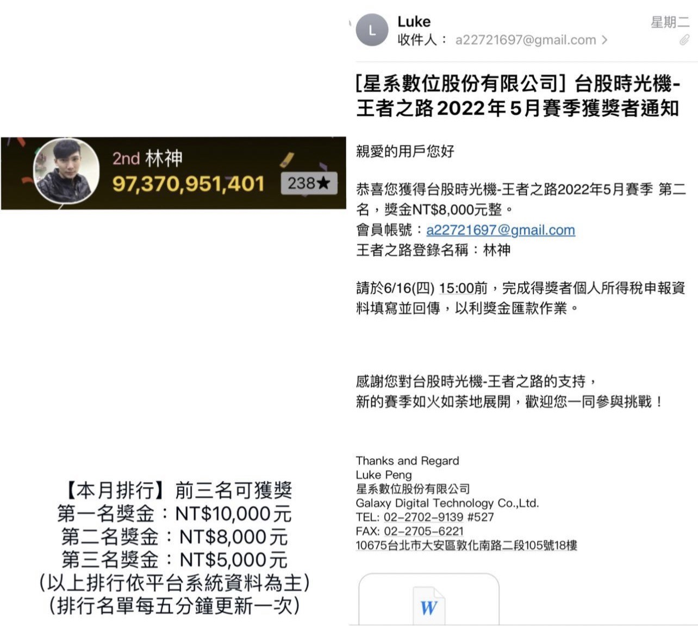

# 🏆 Trading Competition | 王者之路交易大賽 (2022/05)

## 📌 比賽簡介
參加 **台股時光機－第一屆王者之路交易大賽 (2022 年 5 月賽季)**，最終榮獲 **亞軍 (第二名)**，並獲得獎金 **NT$8,000**。  
本次比賽期間正逢 **空頭行情**，我運用 **日內空方動能策略** 在逆勢中獲利。

---

## 📈 績效摘要
- 總報酬率：約 **+21.4%**  
- 最大回撤 (MDD)：約 **-4.2%**  
- 夏普比率：約 **2.3**  
- 榮獲 **第二名 (亞軍)**  

---

## ⚙️ 策略簡介
### 中文
- **策略類型**：日內空方動能策略  
- **核心邏輯**：  
  - 透過 **價格動能** + **成交量突破** 鎖定空頭加速點  
  - 嚴格的 **停損機制**（單檔 -5% 停損）  
  - **當日平倉**，避免隔夜風險  
- **亮點**：  
  - 在空頭行情中，依靠系統化動能策略取得 **+20% 以上報酬**  
  - 展現了 **順勢操作 + 嚴格風控** 的專業量化交易思維  

---

## 🖼️ 獎項證明

